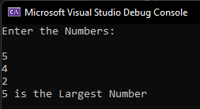

# Largest-of-three-numbers
## Aim:
To write a C# program to find the largest of three numbers

## Algorithm:
### Step1: 
Start
### Step2:
Create a class and declare three variable with integer datatype
### Step3:
Use if condition to check whether num1 is largest than num2 and num3
### Step4:
Use elif condition to check whether num2 is largest than num1 and num3
### Step5:
Use else condition to display that third variable is largest among all the variables
### Step6:
stop

## Program:
~~~
Program Developed by : S.ABHISHEK (212221230002)
Department: B.Tech. Artificial Intelligence and Data Science

using System;
namespace exp1
{
    public class largest
    {
        public static void Main(string[]args)
        {
            int a, b, c;
            Console.WriteLine("Enter the Numbers:\n");
            a=Convert.ToInt32(Console.ReadLine());
            b=Convert.ToInt32(Console.ReadLine());
            c=Convert.ToInt32(Console.ReadLine());
            if (a > b)
            {
                if (a > c)
                    Console.WriteLine(a + " is the Largest Number");
                else
                    Console.WriteLine(c + " is the Largest Number");
            }
            if (b > a)
            {
                if (b > c)
                    Console.WriteLine(b + " is the Largest Number");
                else
                    Console.WriteLine(c + " is the Largest Number");
            }
        }
    }
}
~~~

## Output:

## Result:
Thus the C# program to find the largest of three numbers is executed successfully
